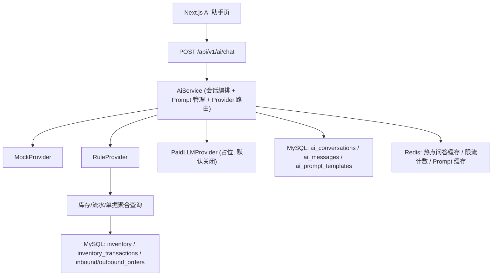

# NovaDepot AI 方案（免费阶段可落地，后期可平滑切换）

## A. AI 模块架构图说明

### 1) 三层 Provider 架构（当前推荐）

### 2) 运行策略
- 默认 `rule`（推荐）或 `mock`，`paid` 默认关闭。
- 所有聊天入口都走同一 `AiService`，前后端不直接依赖具体厂商 SDK。
- 回答结果统一结构化返回：`provider`、`reply`、`confidence`、`conversationId`、`tokens(可空)`、`latencyMs(可空)`。

## B. Provider 抽象接口设计

### 1) 目标
- 屏蔽具体实现差异（Mock/规则/真实大模型）。
- 统一可观测字段，便于审计与后续计费。

### 2) 推荐接口要点
- `providerName()`：返回 `mock/rule/paid`。
- `chat(scene, message, context)`：统一输入输出。
- `supports(scene)`（可选）：支持按场景路由（warehouse/enterprise/sop/cs）。

### 3) 服务层职责
- `AiService`：会话创建、Prompt 模板拼装、Provider 路由、消息落库、降级兜底。
- `AiProviderRouter`（可合并在 Service）：根据 `providerHint + 全局配置 + paid-enabled` 选择最终 Provider。

## C. MockProvider 的实现思路

### 1) 适用阶段
- 前端联调阶段。
- 演示环境。
- 回归测试环境（稳定输出，避免随机性）。

### 2) 行为规则
- 仅模板回复，不访问业务数据库。
- 根据 `scene` 返回不同语气模板（企业助手/仓库助手/客服助手）。
- 输出固定置信度（如 `0.80~0.88`）和可预测 latency。

### 3) 价值
- 让 AI 页面、会话流、日志链路提前跑通。
- 为 RuleProvider 与 PaidProvider 提供统一回归基线。

## D. RuleProvider 的实现思路

### 1) 核心机制
- `关键词识别 + 规则路由 + SQL 聚合 + 模板渲染`。
- 不追求“开放式生成”，追求“可解释、可复现、可审计”。

### 2) 规则链建议
1. 文本预处理：分词/关键词标准化（库存、补货、预警、日报、SOP、经营建议）。
2. 规则匹配：按优先级执行第一命中（可配置）。
3. 数据查询：调用库存与流水表做聚合。
4. 模板生成：按模板输出建议，不做自由发挥。
5. 置信度计算：按命中规则类型给固定区间（如 0.72~0.93）。

### 3) 可配置项（建议放 `application*.yml`）
- 低库存阈值（默认 10）。
- 异常波动阈值（如单次变动 > 100）。
- 日报/周报时间窗口。
- 是否启用 Redis 缓存与缓存 TTL。

## E. 哪些问题可以通过规则引擎先实现

| 能力 | 免费阶段实现方式 | 数据来源 |
|---|---|---|
| 库存问答 | 关键词 + 聚合 SQL（总库存、SKU 数、仓库维度） | `inventory` |
| 低库存分析 | 阈值规则 + TOP N 商品输出 | `inventory` |
| 补货建议 | `建议补货量 = 安全阈值 - 可用库存`（下限 0） | `inventory` |
| 异常库存提示 | 高频变动/大额变动规则，提示核查 | `inventory_transactions` |
| 日报/周报生成 | 固定模板 + 指标填充（入库量/出库量/净变化） | `inventory_transactions` |
| 仓库 SOP 问答 | `faq_knowledge` + 关键字命中 | `faq_knowledge` |

## F. 哪些问题后期适合交给大模型

| 场景 | RuleProvider 局限 | PaidLLMProvider 价值 |
|---|---|---|
| 企业经营建议 | 规则只能做固定策略 | 可做多维推理与语言润色 |
| 跨模块复杂问答 | 规则维护成本高 | 更强泛化与语义理解 |
| 多轮上下文追问 | 规则上下文弱 | 更好上下文记忆 |
| 自然语言改写 | 模板化明显 | 更自然的人机对话体验 |
| 多语言支持 | 规则需重复配置 | 模型天然支持更好 |

## G. 前端聊天体验如何先做出来

### 1) MVP 交互
- 左侧会话列表 + 中间消息流 + 顶部场景切换（enterprise/warehouse/sop）。
- 支持“快速问题 Chips”：低库存、补货建议、今日日报。
- 消息发送后显示 `Provider 标签`（Mock/Rule）。

### 2) 无付费模型阶段的“AI 感知”
- 输出结构化卡片：低库存 TOP5、建议补货 SKU、日报摘要。
- 用“正在分析库存数据...”的短 loading 动画模拟思考过程（200~800ms）。
- 支持“复制建议/生成工单/跳转库存页”业务动作按钮。

### 3) Docker 联调约束
- 前端通过 `NEXT_PUBLIC_API_BASE_URL` 指向后端，如 `http://localhost:8080/api/v1`。
- 页面不要写死域名，统一从环境变量读 Base URL。

## H. 后端如何统一管理 prompt、回复、会话

### 1) 会话
- 表：`ai_conversations`
- 作用：记录场景、provider、状态、开始/结束时间、业务关联（`biz_type/biz_no`）。

### 2) 消息
- 表：`ai_messages`
- 作用：存储用户提问与系统回复，沉淀后续评估数据。
- 建议记录：`role/content/confidence/latency_ms/error_code`。

### 3) Prompt 模板
- 表：`ai_prompt_templates`
- 作用：不同场景模板可运营配置（版本化、启停）。
- 回退机制：DB 无模板时走代码内置默认模板。

## I. 如何记录 AI 对话日志

### 1) 业务日志（ai_messages）
- 每次交互至少写两条：`USER` + `ASSISTANT`。
- 失败时也要写 `ASSISTANT`，`error_code` 填充，便于排障。

### 2) 审计日志（audit_logs）
- 关键动作（切换 Provider、人工转接、模板变更）写审计日志。
- 字段建议：`module=AI`、`action=CHAT/SWITCH_PROVIDER/UPDATE_TEMPLATE`。

### 3) Redis 辅助日志能力
- 限流计数（按用户/租户）。
- 热门问题缓存（降低 SQL 压力）。
- Provider 降级熔断状态（paid 不可用时自动回退 rule/mock）。

## J. 后期切换到真实付费 API 而不大改前后端

### 1) 切换原则
- Controller 路径不变：`/api/v1/ai/chat`。
- 前端请求结构不变：`scene + message + providerHint(optional)`。
- `AiService` 统一路由，不让业务模块直接调用厂商 SDK。

### 2) 配置开关（建议）
- `app.ai.provider=rule|mock|paid`
- `app.ai.paid-enabled=false|true`
- `app.ai.paid.base-url=...`
- `app.ai.paid.api-key=...`（生产环境用密钥管理）

### 3) 上线步骤
1. 保持默认 `rule`，灰度开启部分租户 `paid-enabled=true`。
2. 比较 `rule` 与 `paid` 的命中率、满意度、耗时和成本。
3. 对高价值场景（经营建议、复杂问答）优先切到 `paid`，标准问答保留 `rule` 降本。

### 4) Docker / Compose 约束
- `backend` 注入 AI 配置环境变量，避免写死在镜像内。
- 本地开发默认 `paid-enabled=false`，保证离线可跑。
- 后续接付费 API 仅需更新环境变量和 Provider 实现，不改前端路由与页面。

---

## 附：推荐分阶段能力开关

| 阶段 | 默认 Provider | 开启能力 | 备注 |
|---|---|---|---|
| MVP | `mock` | 聊天页、会话管理、日志链路 | 先保证链路可运行 |
| 可用版 | `rule` | 库存问答、低库存、补货、日报周报、SOP | 不依赖付费 API |
| 商用版 | `rule + paid` | 复杂建议、自然语言增强、客服增强 | 灰度切换，保留规则兜底 |

## 2026-04-10 ��С������·����
- ǰ�˷�����Ϣͳһ���� POST /api/v1/ai/chat��
- ���� Docker ��������ʹ����� Provider��rule��ʧ�ܻ��� mock���������� PaidProvider��
- ǰ������ʾ����ʧ����ʾ������δ��¼����Ȩʧ�ܡ�������󣩡�
